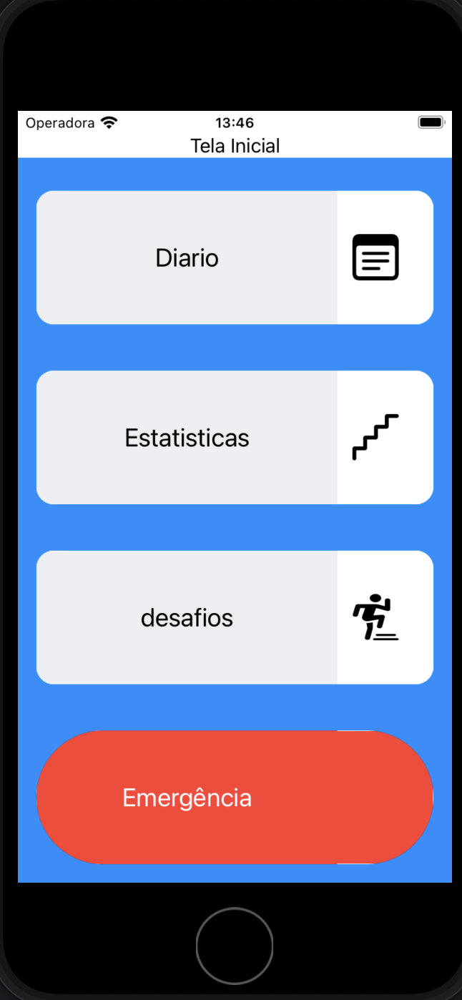
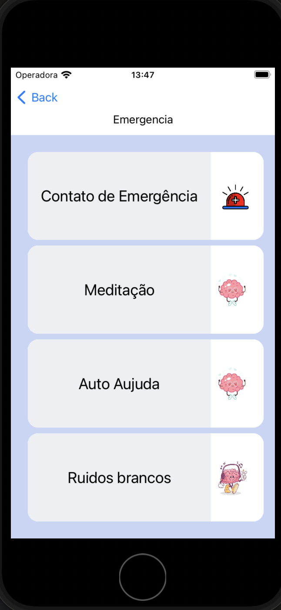
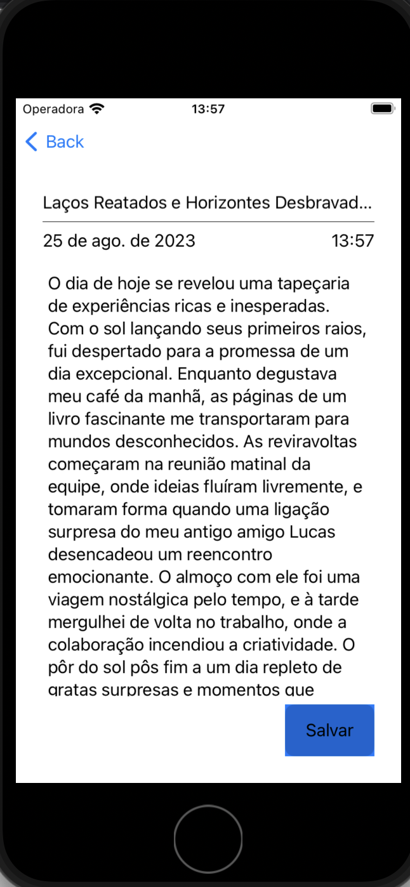
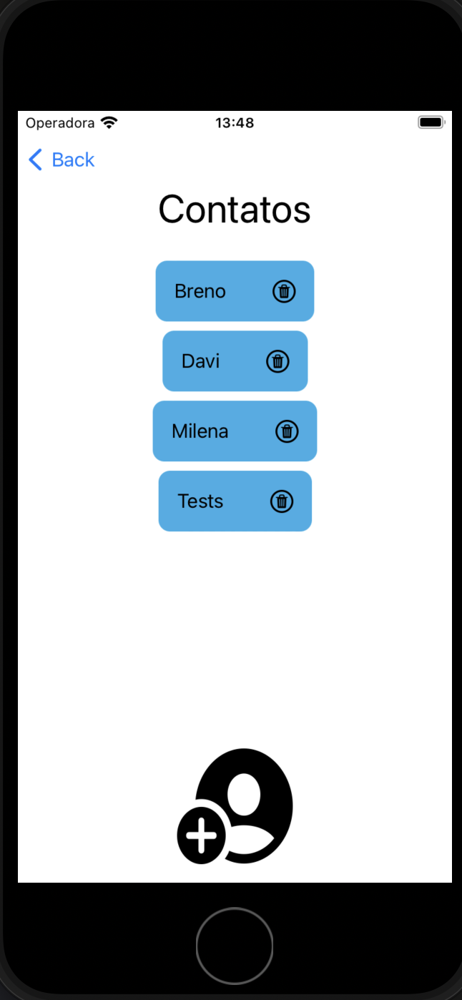
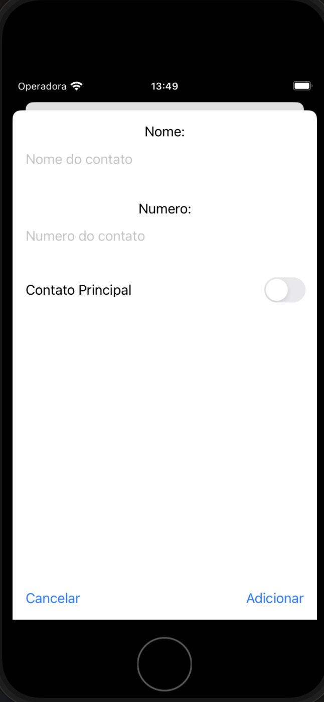

# Projeto Hacktruck

Este é o projeto final para o hackathon Hacktruck, realizado em parceria com a IBM, pelo Instituto Eldorado e com o apoio de outras empresas. O projeto envolveu um processo seletivo e um curso EAD. Após 5 semanas de estudos presenciais, onde exploramos diversas tecnologias e enfrentamos desafios diários como parte da metodologia ativa, chegamos à última semana do hackathon. Nessa última etapa, fomos desafiados a criar uma solução usando as tecnologias que aprendemos. Foi então que o nosso grupo de trabalho deu vida ao "Psycoduck", um aplicativo com o objetivo de auxiliar pessoas que enfrentam ansiedade e outras síndromes psicológicas, com um botão com mensagens prontas para pedir ajuda, para facilitar e diminuir a chance do pasciente ficar inibido de pedir ajuda por vergonha ou não conseguir. Além disso, consideramos a possibilidade de oferecer acompanhamento psicológico. Para o desenvolvimento do aplicativo, utilizamos SwiftUI, bibliotecas para áudio, Node-RED para fluxo de dados, consumo de APIs REST e o banco de dados Cloudant, fornecido pela IBM.

## Tecnologias Utilizadas

- SwiftUI: Framework de IU para o desenvolvimento de interfaces de usuário.
- Bibliotecas para Áudio: Utilizadas para recursos de áudio no aplicativo.
- Node-RED: Plataforma de código aberto para criar fluxos de dados.
- APIs REST: Utilizadas para interações com serviços externos.
- Banco de Dados Cloudant: Banco de dados fornecido pela IBM para armazenamento de dados.

## Integrantes do Grupo
M
- [Davi Rocha](https://www.linkedin.com/in/davi-rocha-negocio/)
- [Giovanna Guzzardi](https://www.linkedin.com/in/giovanna-guzzardi-707b6426b/)
- [Breno Palma](https://www.linkedin.com/in/breno-palma-768a3a230/)
- [Lousane Rodrigues](https://www.linkedin.com/in/lousane-rodrigues/)

## Vídeo do Projeto

Assista ao vídeo do nosso projeto no [YouTube](https://www.youtube.com/watch?v=e41YKljGMFA).

## Telas

